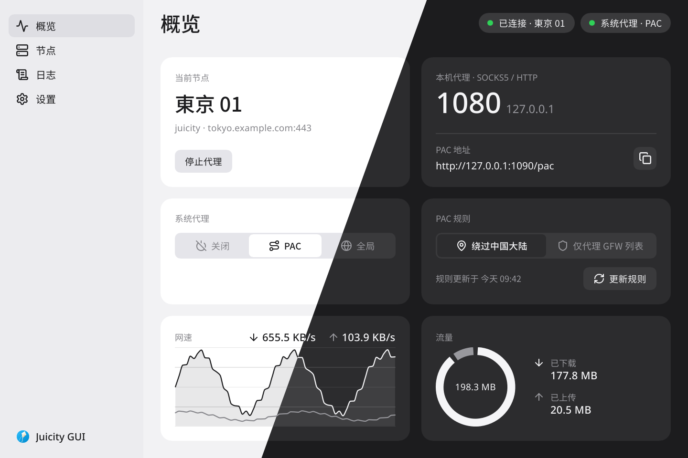
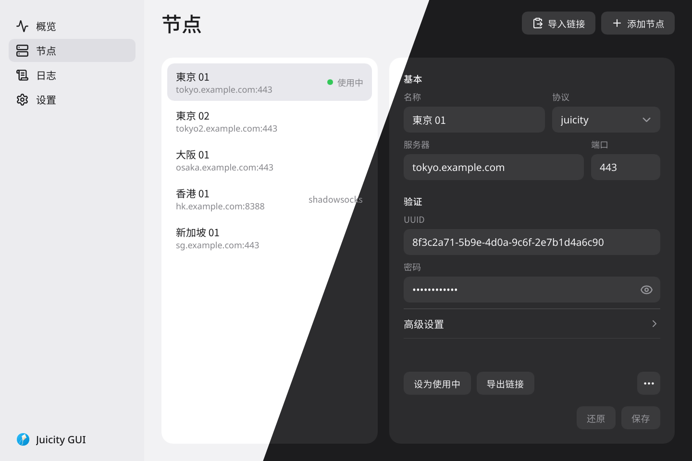

<div align="center">


# Juicity-RS

**以 Rust 实现的 Juicity 客户端、服务端与桌面图形界面。**

[English](README.md) · 简体中文

[特性](#特性) • [图形界面](#图形界面) • [构建](#构建) • [配置](#配置) • [使用](#使用) • [协议](#协议)

</div>

[Juicity](https://github.com/juicity/juicity) 协议的 Rust 实现——一个基于 QUIC 的代理，通过**UDP over Stream** 改进了 TUIC 的 UDP 处理方式，将 UDP 流量复用/承载于双向 QUIC 流上。

## 特性

- **基于 QUIC 传输** — 构建于 [`quinn`](https://github.com/quinn-rs/quinn) v0.11
- **SOCKS5 和 HTTP CONNECT 代理** —— 本地代理服务器，完整支持 SOCKS5（CONNECT + UDP ASSOCIATE）和 HTTP CONNECT
- **TCP/UDP 端口转发** —— 通过 QUIC 连接将本地端口转发到远程目标，支持按条目的协议过滤（`/tcp`、`/udp` 或两者）
- **可配置的拥塞控制** —— BBR（默认）、CUBIC 或 NewReno；对客户端和服务端均生效（参见[拥塞控制](#拥塞控制)）
- **Full-cone NAT UDP** —— 底层 UDP 使用 ChaCha20-Poly1305（HKDF-SHA1）加密，与 Go 版本兼容
- **TLS 认证** —— RFC 5705 导出密钥材料（EKM），算法与上游完全一致
- **证书固定** —— `pinned_certchain_sha256`（支持 base64 或 hex）
- **分享链接与二维码** —— `juicity://` URI 生成、终端 ANSI 二维码以及 PNG 导出
- **双栈服务端** —— `:port` 简写绑定 `[::]:port`，并设置 `IPV6_V6ONLY=false`
- **密码内存安全** —— 客户端密码存储在 `Zeroizing<String>` 中，析构时清零

## 图形界面



`gui/` 是基于 Slint 的原生桌面应用，支持 Linux、Windows 与 macOS。它在自身进程内运行 Juicity 与 Shadowsocks 客户端，管理节点与分享链接，设置系统代理（关闭、PAC 或全局），显示网速、流量与日志，关闭窗口后在托盘中继续运行。界面支持英文、简体中文、繁体中文与俄文，提供浅色与深色主题。构建与运行方法见 [GUI 说明](gui/README.md)。



## 项目结构

```
juicity-common/       # 共享库：配置、协议线格式、加解密、常量、链接生成
juicity-client/       # 客户端程序：QUIC 客户端、SOCKS5/HTTP 代理、TCP/UDP 转发
juicity-server/       # 服务端程序：QUIC 监听、TCP/UDP 中转、底层 UDP 解复用
gui/                  # 可选的图形界面前端（桌面托盘应用）
```

### 各 crate 概览

| Crate | 主要类型 |
|-------|----------|
| [`juicity-common`](common/src/lib.rs) | `Config`、`protocol`（线格式）、`crypto`（AES-GCM、ChaCha20-Poly1305、证书链哈希）、`consts`、`link` |
| [`juicity-client`](client/src/lib.rs) | `JuicityClient`（QUIC+认证）、`LocalServer`（SOCKS5/HTTP）、`Forwarder`（TCP/UDP） |
| [`juicity-server`](server/src/lib.rs) | `JuicityServer`（监听+中转）、`Dialer`、`InFlightUnderlayKey`、`UdpEndpointPool`、`DemuxUdpSocket` |

Docker 服务端镜像、Compose 示例与发布流程：[Docker 使用说明](docker/README.md)。

## 构建

```bash
cargo build --release
# 可执行文件：target/release/juicity-client   target/release/juicity-server
```

**依赖要求：** Rust stable（2021 edition），TLS 需要 `aws-lc-rs`（由 `rustls` 引入）。

## 配置

服务端与客户端各自使用不同的 JSON 配置文件（server.json 与 client.json）。两者共用 `congestion_control` 与 `log_level` 两个字段。未知字段会被忽略；缺失字段会回退到默认值。

### 服务端（`server.json`）

```json
{
  "listen": ":443",
  "users": {
    "00000000-0000-0000-0000-000000000000": "your-password"
  },
  "certificate": "/path/to/cert.pem",
  "private_key": "/path/to/key.pem",
  "congestion_control": "bbr",
  "log_level": "info",
  "send_through": "",
  "fwmark": "",
  "dialer_link": "",
  "disable_outbound_udp443": false
}
```

> **IPv6 支持：** `listen` 字段支持 IPv6 地址及双栈简写。
> - IPv6 字面量：`"[::1]:443"`（仅 IPv6）
> - 双栈简写：`":443"` 等价于 `"[::]:443"` 并设置 `IPV6_V6ONLY=false`，同时监听 IPv4 和 IPv6
> - 标准 IPv4：`"0.0.0.0:443"`（仅 IPv4）

| 字段 | 类型 | 默认值 | 说明 |
|------|------|--------|------|
| `listen` | string | — | 监听地址（`host:port`；IPv6 用 `[host]:port`；双栈用 `:port`） |
| `users` | object | — | `{ uuid: password }` 映射 |
| `certificate` | string | — | PEM 证书文件路径 |
| `private_key` | string | — | PEM 私钥文件路径 |
| `congestion_control` | string | `"bbr"` | `"bbr"`、`"cubic"` 或 `"newreno"`（详见[拥塞控制](#拥塞控制)） |
| `log_level` | string | `"info"` | `trace` / `debug` / `info` / `warn` / `error` |
| `send_through` | string | `""` | 出站连接绑定的 IP |
| `fwmark` | string | `""` | 出站 socket 的 Linux SO_MARK |
| `dialer_link` | string | `""` | 与 Go 兼容的 dialer link |
| `disable_outbound_udp443` | bool | `false` | 屏蔽端口 443 的出站 UDP |

### 客户端（`client.json`）

```json
{
  "server": "example.com:443",
  "uuid": "00000000-0000-0000-0000-000000000000",
  "password": "your-password",
  "listen": "127.0.0.1:1080",
  "sni": "example.com",
  "allow_insecure": false,
  "pinned_certchain_sha256": "",
  "congestion_control": "bbr",
  "log_level": "info",
  "forward": {}
}
```

> **IPv6 支持：** `server` 与 `listen` 字段均支持 IPv6 地址。
> - 服务端：`"server": "[::1]:443"` 或 `"server": "2001:db8::1:443"`
> - 监听（仅 IPv6）：`"listen": "[::1]:1080"`
> - 监听（双栈）：`"listen": "[::]:1080"` 或简写 `":1080"`
> - 本地监听：`"listen": "127.0.0.1:1080"`（仅 IPv4，默认推荐）

| 字段 | 类型 | 默认值 | 说明 |
|------|------|--------|------|
| `server` | string | — | 服务端地址（`host:port`；IPv6 用 `[host]:port`） |
| `uuid` | string | — | 用户 UUID |
| `password` | string | — | 用户密码（退出时从内存清零） |
| `listen` | string | `""` | 本地代理监听地址（`host:port`；IPv6 用 `[host]:port`；双栈用 `:port`）；设置 `forward` 时可缺省 |
| `sni` | string | 服务端 IP | TLS SNI 覆盖项 |
| `allow_insecure` | bool | `false` | 跳过 TLS 证书校验（**不安全**，会记录警告日志） |
| `pinned_certchain_sha256` | string | `""` | 服务端证书链的期望 SHA-256 值（base64 或 hex） |
| `congestion_control` | string | `"bbr"` | `"bbr"`、`"cubic"` 或 `"newreno"`（详见[拥塞控制](#拥塞控制)） |
| `log_level` | string | `"info"` | 日志级别 |
| `forward` | object | `{}` | 端口转发条目（见下文） |
| `protect_path` | string | `""` | 与 Go 兼容的 protect_path socket |

## 使用

### 服务端

```bash
juicity-server run -c server.json
# 简写：
juicity-server -c server.json
```

### 客户端

```bash
# 在 127.0.0.1:1080 提供 SOCKS5/HTTP 代理
juicity-client run -c client.json

# 开启 debug 日志
juicity-client run -c client.json --log-level debug
```

### 端口转发

`forward` 映射条目的格式为 `"local_addr[/protocol]": "remote_target"`。

```json
{
  "forward": {
    "127.0.0.1:8080": "example.com:80",
    "127.0.0.1:5353/udp": "8.8.8.8:53",
    "0.0.0.0:2222/tcp": "internal.host:22"
  }
}
```

- 无协议后缀 → 同时支持 TCP 和 UDP
- `/tcp` → 仅 TCP
- `/udp` → 仅 UDP

当 `listen` 为空且 `forward` 非空时，客户端以纯转发模式运行并保持存活。

### 分享链接与二维码

```bash
# 打印 juicity:// URI
juicity-client export -c client.json --link
juicity-server export -c server.json --link

# 在终端打印 ANSI 二维码
juicity-client export -c client.json --qrcode

# 将二维码保存为 PNG
juicity-client export -c client.json --qrcode-png ./qr.png

# 导出配置 JSON
juicity-server export -c server.json --json-server
juicity-server export -c server.json --json-client --socks-port 1080
```

**分享链接格式：**
```
juicity://<uuid>:<password>@<host>:<port>?sni=<sni>&congestion_control=<cc>&allow_insecure=<0|1>&pinned_certchain_sha256=<hash>
```

## 拥塞控制

客户端与服务端之间的 QUIC 连接使用由 `congestion_control` 字段（`"bbr"`、`"cubic"` 或 `"newreno"`）选择的端到端拥塞控制算法。这三种算法仅作用于代理端点之间的网络链路——不会改变应用层、UDP 或 TLS 的行为。

### 对比表

| 算法 | 反馈依据 | 拥塞反应 | 最适合的场景 |
|------|----------|----------|--------------|
| **NewReno** | 丢包（AIMD） | 加性增、乘性减；丢包时窗口减半 | 通用最低标准；最保守、最公平，带宽爬升慢 |
| **CUBIC** | 丢包（基于时间的三次函数） | 窗口按照随时间变化的三次曲线增长，与 RTT 无关 | 高带宽-时延积链路，与标准 TCP 共存，兼顾公平性 |
| **BBR**（默认） | 实测瓶颈带宽与 RTT | 按实测可用带宽限速，不因丢包而盲目减窗 | 高丢包 / 高 RTT / 网络波动大的链路（如跨境无线），吞吐与延迟最佳 |

### 详细介绍

- **NewReno** —— 经典的*加性增、乘性减*（AIMD）机制。每个 RTT 大约增加一个报文段，发生丢包时将拥塞窗口减半，随后进入快速恢复。其简单且可证明公平的行为与其他感知拥塞的流量高度兼容，但带宽爬升缓慢，在高带宽链路上利用率偏低。
- **CUBIC** —— 拥塞窗口沿一条**三次**（三阶）曲线增长，该曲线只取决于距上次丢包的时间，而与 RTT 无关。丢包后会快速增长回先前的窗口附近，再平滑地探测更多带宽。这使得它在高 RTT 的长链路上比 Reno 有高得多的利用率，同时对待竞争流量仍较公平。
- **BBR** —— 不以丢包作为反馈，而是周期性估算**瓶颈带宽（BtlBw/BDP）**和**往返传播时延（RTprop）**，并根据这些测量值设定发送速率。由于它不会响应丢包而缩小窗口，因此在有丢包或"缓冲膨胀"的链路上能保持较高吞吐，实际中延迟和吞吐表现最佳——这也是将其作为此处默认值的原因。

> **注意：** 在本实现中，默认的 BBR 还会将初始窗口设置为 `10 × ETHERNET_MTU` 字节以便更快收敛（`common/src/consts.rs`）。

### 该选哪个？

- 默认使用 **`bbr`** 可获得最佳的跨网稳定性和吞吐，尤其是在有丢包或拥塞的路径上。
- 如果想与标准 TCP 流量共享链路并获得更公平的共存，请使用 **`cubic`**。
- 需要最大限度的保守以及混合环境下最佳的好网络共存表现，请使用 **`newreno`**。

## 协议

Juicity 是在**原生 TUIC 基础之上的改造**：Juicity 通过**UDP over Stream** 扩展了 TUIC 协议——UDP 数据报被复用/承载于双向 QUIC 流上，避免 TUIC 逐数据报流转发的开销，也避免了原生 UDP 模式的重传风暴。

> **关于 UDP over Stream 与 TUIC：** 原生 TUIC（`tuic-protocol/tuic` 规范）的 UDP 通过纯 QUIC 数据报 / UDP socket 中继，本身**并未定义**"UDP over Stream"模式。后来由 **mihomo** 和 **sing-box** 的服务端/客户端实现各自新增了*仅同名*的 "UDP over stream" / `udp_over_stream` 扩展——这些是不同的附加协议（例如 sing-box 文档指出 `udp_over_stream` 是"UDP over TCP"的移植，且与 `udp_relay_mode` 冲突），与 Juicity 的线格式互不兼容。本项目中的 UDP over Stream 遵循 **Juicity** 协议，仅能在 Juicity 端点之间互通。

### 线格式（与 TUIC 兼容）

| 命令 | 代码 | 格式 |
|------|------|------|
| 认证 Authenticate | `0x00` | `[ver=0][0x00][uuid(16)][token(32)]` —— 令牌来自 TLS EKM（RFC 5705） |
| 连接 Connect (TCP) | `0x01` | `[ver=0][0x01][network=1][trojanc_addr]` —— 流承载 TCP 数据 |
| 数据包 Packet (UDP) | `0x02` | `[ver=0][0x02][network=3][trojanc_addr]` —— 数据报为 `[addr][len(2)][payload]` |
| 解散 Dissociate | `0x03` | — |
| 心跳 Heartbeat | `0x04` | — |

**地址编码**遵循 trojanc 格式：`[type][addr][port(2)]`，其中 `type` 的 `1`=IPv4、`3`=域名、`4`=IPv6。

### 底层 UDP（Full-cone NAT）

非 QUIC 的 UDP 数据包用于实现 full-cone NAT 兼容性。每个数据包的加密方式如下：

```
[salt(32)] [ChaCha20-Poly1305(subkey, nonce=0, plaintext)]
subkey = HKDF-SHA1(psk, salt, "juicity-reused-info")
```

## 关键设计决策

| 关注点 | 方案 |
|--------|------|
| 并发重连 | `reconnect_lock: Mutex<()>` 串行化 `connect()` 中的慢路径；快速路径使用读锁 |
| 拥塞控制 | 启动时通过 `congestion_control` 字段配置；应用于 QUIC `TransportConfig` |
| 清理正确性 | 在调用中止句柄之前，先在会话互斥锁外收集它们 |
| 底层通知 | 使用 `notify_one()` 而非 `notify_waiters()`，以避免 `InFlightUnderlayKey` 上的惊群效应 |
| 密码安全 | `zeroize::Zeroizing<String>` 在析构时清零内存 |
| UDP 取消 | 统一使用 `CancellationToken`；不再混用 `oneshot` 通道 |
| UdpEndpoint 生命周期 | 字段 `last_used` 记录实际的最后使用时间（由 `touch()` 重置），而非创建时间 |

## 与 Go 版 Juicity 的兼容性

线协议、认证算法与底层加解密与 Go 参考实现逐字节兼容。不兼容的配置项（如 `fwmark`、`dialer_link`）会被解析，但如果底层功能尚未实现，则可能被静默忽略。

## 许可证

GNU AFFERO GENERAL PUBLIC LICENSE Version 3（AGPL-3.0）—— 参见 [LICENSE](LICENSE)。