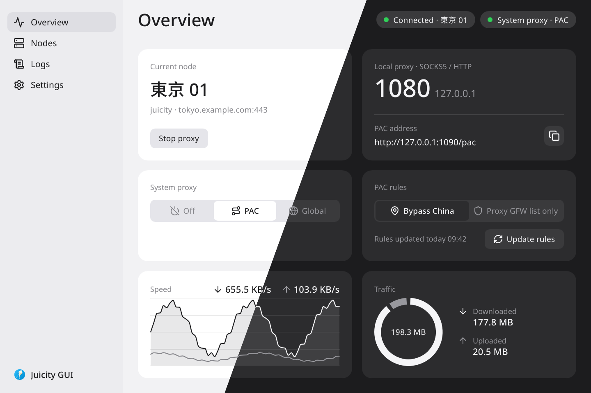
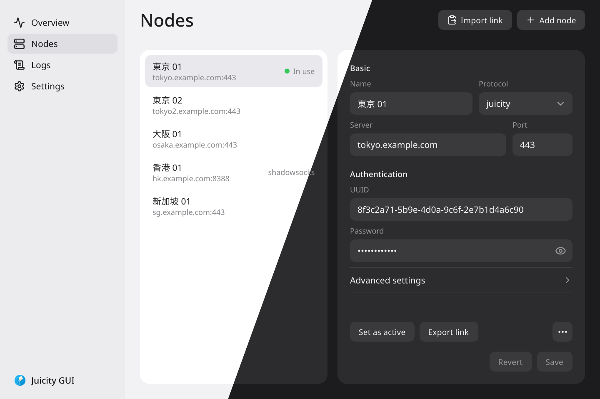

<div align="center">


# Juicity-RS

**Juicity client, server and desktop GUI, written in Rust.**

English · [简体中文](README-zh_hans.md)

[Features](#features) • [GUI](#gui) • [Build](#build) • [Configuration](#configuration) • [Usage](#usage) • [Protocol](#protocol)

</div>

A Rust implementation of the [Juicity](https://github.com/juicity/juicity) protocol — a QUIC-based proxy that improves on TUIC's UDP handling with **UDP over Stream**, multiplexing UDP traffic over bidirectional QUIC streams.

## Features

- **QUIC-based transport** — built on [`quinn`](https://github.com/quinn-rs/quinn) v0.11
- **SOCKS5 and HTTP CONNECT proxy** — local proxy server with full SOCKS5 (CONNECT + UDP ASSOCIATE) and HTTP CONNECT support
- **TCP/UDP port forwarding** — forward local ports to remote targets through the QUIC connection, with per-entry protocol filter (`/tcp`, `/udp`, or both)
- **Configurable congestion control** — BBR (default), CUBIC, or NewReno; applies to both client and server (see [Congestion Control](#congestion-control))
- **Full-cone NAT UDP** — underlay UDP encrypted with ChaCha20-Poly1305 (HKDF-SHA1), compatible with the Go version
- **TLS authentication** — RFC 5705 Export Keying Material, identical algorithm to upstream
- **Certificate pinning** — `pinned_certchain_sha256` (accepts base64 or hex)
- **Share link & QR code** — `juicity://` URI generation, terminal ANSI QR code, and PNG export
- **Dual-stack server** — `:port` shorthand binds `[::]:port` with `IPV6_V6ONLY=false`
- **Password memory safety** — client password is stored in `Zeroizing<String>` and zeroed on drop

## GUI



`gui/` is a native desktop app for Linux, Windows and macOS, built with Slint. It runs the Juicity and Shadowsocks clients inside its own process, manages nodes and share links, sets the system proxy (off, PAC or global), shows speed, usage and logs, and keeps running in the tray when the window is closed. The interface is in English, Simplified Chinese, Traditional Chinese and Russian, with light and dark themes. Build and run it with the [GUI guide](gui/README.md).



## Project Structure

```
juicity-common/       # Shared library: config, protocol wire format, crypto, constants, link generation
juicity-client/       # Client binary: QUIC client, SOCKS5/HTTP proxy, TCP/UDP forwarder
juicity-server/       # Server binary: QUIC listener, TCP/UDP relay, underlay UDP demux
gui/                  # Optional GUI front-end (Slint desktop tray app)
```

### Crate Overview

| Crate | Key types |
|-------|-----------|
| [`juicity-common`](common/src/lib.rs) | `Config`, `protocol` (wire format), `crypto` (AES-GCM, ChaCha20-Poly1305, cert chain hash), `consts`, `link` |
| [`juicity-client`](client/src/lib.rs) | `JuicityClient` (QUIC+auth), `LocalServer` (SOCKS5/HTTP), `Forwarder` (TCP/UDP) |
| [`juicity-server`](server/src/lib.rs) | `JuicityServer` (listener+relay), `Dialer`, `InFlightUnderlayKey`, `UdpEndpointPool`, `DemuxUdpSocket` |

Docker server packaging, Compose usage, and release publication: [Docker guide](docker/README.md).

## Build

```bash
cargo build --release
# Binaries: target/release/juicity-client  target/release/juicity-server
```

**Requirements:** Rust stable (2021 edition), `aws-lc-rs` for TLS (included via `rustls`).

## Configuration

The server and client each use their own JSON config format (see below). Both share the common `congestion_control` and `log_level` fields. Unknown fields are ignored; missing fields fall back to their defaults.

### Server (`server.json`)

```json
{
  "listen": ":443",
  "users": {
    "00000000-0000-0000-0000-000000000000": "your-password"
  },
  "certificate": "/path/to/cert.pem",
  "private_key": "/path/to/key.pem",
  "congestion_control": "bbr",
  "log_level": "info",
  "send_through": "",
  "fwmark": "",
  "dialer_link": "",
  "disable_outbound_udp443": false
}
```

> **IPv6 Support:** The `listen` field supports IPv6 addresses and dual-stack shorthand.
> - IPv6 literal: `"[::1]:443"` (IPv6 only)
> - Dual-stack shorthand: `":443"` is equivalent to `"[::]:443"` with `IPV6_V6ONLY=false`, listening on both IPv4 and IPv6
> - Standard IPv4: `"0.0.0.0:443"` (IPv4 only)

| Field | Type | Default | Description |
|-------|------|---------|-------------|
| `listen` | string | — | Listen address (`host:port`, `[host]:port` for IPv6, or `:port` for dual-stack) |
| `users` | object | — | `{ uuid: password }` map |
| `certificate` | string | — | PEM certificate file path |
| `private_key` | string | — | PEM private key file path |
| `congestion_control` | string | `"bbr"` | `"bbr"`, `"cubic"`, or `"newreno"` |
| `log_level` | string | `"info"` | `trace` / `debug` / `info` / `warn` / `error` |
| `send_through` | string | `""` | Bind outbound connections to this IP |
| `fwmark` | string | `""` | Linux SO_MARK for outbound sockets |
| `dialer_link` | string | `""` | Go-compatible dialer link |
| `disable_outbound_udp443` | bool | `false` | Block outbound UDP on port 443 |

### Client (`client.json`)

```json
{
  "server": "example.com:443",
  "uuid": "00000000-0000-0000-0000-000000000000",
  "password": "your-password",
  "listen": "127.0.0.1:1080",
  "sni": "example.com",
  "allow_insecure": false,
  "pinned_certchain_sha256": "",
  "congestion_control": "bbr",
  "log_level": "info",
  "forward": {}
}
```

> **IPv6 Support:** Both the `server` and `listen` fields support IPv6 addresses.
> - Server: `"server": "[::1]:443"` or `"server": "2001:db8::1:443"`
> - Listen (IPv6 only): `"listen": "[::1]:1080"`
> - Listen (dual-stack): `"listen": "[::]:1080"` or shorthand `":1080"`
> - Local listen: `"listen": "127.0.0.1:1080"` (IPv4 only, default recommended)

| Field | Type | Default | Description |
|-------|------|---------|-------------|
| `server` | string | — | Server address (`host:port` or `[host]:port` for IPv6) |
| `uuid` | string | — | User UUID |
| `password` | string | — | User password (zeroed from memory on exit) |
| `listen` | string | `""` | Local proxy listen address (`host:port`, `[host]:port` for IPv6, or `:port` for dual-stack); required unless `forward` is set |
| `sni` | string | server IP | TLS SNI override |
| `allow_insecure` | bool | `false` | Skip TLS cert verification (**insecure**, logs a warning) |
| `pinned_certchain_sha256` | string | `""` | Expected SHA-256 of the server cert chain (base64 or hex) |
| `congestion_control` | string | `"bbr"` | `"bbr"`, `"cubic"`, or `"newreno"` |
| `log_level` | string | `"info"` | Log level |
| `forward` | object | `{}` | Port forwarding entries (see below) |
| `protect_path` | string | `""` | Go-compatible protect_path socket |

## Usage

### Server

```bash
juicity-server run -c server.json
# Shorthand:
juicity-server -c server.json
```

### Client

```bash
# SOCKS5/HTTP proxy on 127.0.0.1:1080
juicity-client run -c client.json

# With debug logging
juicity-client run -c client.json --log-level debug
```

### Port Forwarding

The `forward` map entries follow the format `"local_addr[/protocol]": "remote_target"`.

```json
{
  "forward": {
    "127.0.0.1:8080": "example.com:80",
    "127.0.0.1:5353/udp": "8.8.8.8:53",
    "0.0.0.0:2222/tcp": "internal.host:22"
  }
}
```

- No protocol suffix → both TCP and UDP
- `/tcp` → TCP only
- `/udp` → UDP only

When `listen` is empty and `forward` is non-empty, the client runs in forward-only mode and stays alive.

### Share Link & QR Code

```bash
# Print juicity:// URI
juicity-client export -c client.json --link
juicity-server export -c server.json --link

# Print ANSI QR code to terminal
juicity-client export -c client.json --qrcode

# Save QR code as PNG
juicity-client export -c client.json --qrcode-png ./qr.png

# Export config JSON
juicity-server export -c server.json --json-server
juicity-server export -c server.json --json-client --socks-port 1080
```

**Share link format:**
```
juicity://<uuid>:<password>@<host>:<port>?sni=<sni>&congestion_control=<cc>&allow_insecure=<0|1>&pinned_certchain_sha256=<hash>
```

## Congestion Control

The QUIC connection between client and server uses an end-to-end congestion control algorithm selected via the `congestion_control` field (`"bbr"`, `"cubic"`, or `"newreno"`). All three only affect the network link between the proxy endpoints — they do not change the application, UDP, or TLS behaviour.

### Comparison

| Algorithm | Feedback used | Congestion reaction | Best suited for |
|-----------|---------------|---------------------|-----------------|
| **NewReno** | loss (AIMD) | additive increase, multiplicative decrease; window halves on loss | Lowest common denominator; most conservative & fair, slow to ramp up bandwidth |
| **CUBIC** | loss (time-based cubic function) | window grows along a cubic curve over time, not RTT | High bandwidth-delay-product links, co-existing with standard TCP, best-effort fairness |
| **BBR** (default) | measured bottleneck bandwidth & RTT | paces sending rate to measured available bandwidth; does not blindly shrink on loss | Lossy / high-RTT / variable networks (e.g. cross-border wireless); best throughput & latency |

### Details

- **NewReno** — the classic *additive increase, multiplicative decrease* (AIMD) scheme. It adds roughly one segment per RTT and halves the congestion window on packet loss, then enters fast recovery. Its simple, provably fair behaviour is very compatible with other congestion-aware traffic, but it ramps up throughput slowly and under-utilises high-bandwidth links.
- **CUBIC** — grows the congestion window along a **cubic** (third-degree) curve that depends only on the time since the last loss, not on RTT. After a loss it quickly grows back toward the previous window, then probes for additional bandwidth more smoothly. This gives much higher utilisation on long, high-RTT links than Reno while remaining reasonably fair to competing flows.
- **BBR** — rather than using loss as feedback, BBR periodically estimates the **bottleneck bandwidth (BtlBw/BDP)** and the **round-trip propagation time (RTprop)** and sets its sending rate from those measurements. Because it does not shrink the window in response to loss, it keeps throughput high on lossy or "buffer-bloated" links, giving the best latency and throughput in practice — which is why it is the default here.

> **Note:** In this implementation the default BBR additionally sets an initial window of `10 × ETHERNET_MTU` bytes for faster convergence (`common/src/consts.rs`).

### Which should I choose?

- Default to **`bbr`** for the best cross-network stability and throughput, especially on lossy or congested paths.
- Use **`cubic`** if you share a link with standard TCP traffic and want fairer coexistence.
- Use **`newreno`** for maximum conservatism and best effort-goodput compatibility in mixed environments.

## Protocol

Juicity is a **modification built on top of native TUIC**: Juicity extends the TUIC protocol with **UDP over Stream** — UDP datagrams are multiplexed over bidirectional QUIC streams, avoiding the per-datagram stream overhead of TUIC and the retransmission storm of native UDP mode.

> **About UDP over Stream and TUIC:** Native TUIC (the `tuic-protocol/tuic` spec) relays UDP over plain QUIC datagrams / UDP sockets and does **not** define a "UDP over Stream" mode. Later **mihomo** and **sing-box** server/client implementations added their own *compatible-in-name-only* "UDP over stream" / `udp_over_stream` extensions — these are separate add-on protocols (e.g. sing-box documents `udp_over_stream` as a port of "UDP over TCP", and it conflicts with `udp_relay_mode`), mutually incompatible with Juicity's wire format. The UDP-over-Stream framing in this project follows the **Juicity** protocol and is only interoperable between Juicity endpoints.

### Wire Format (TUIC-compatible)

| Command | Code | Format |
|---------|------|--------|
| Authenticate | `0x00` | `[ver=0][0x00][uuid(16)][token(32)]` — token from TLS EKM (RFC 5705) |
| Connect (TCP) | `0x01` | `[ver=0][0x01][network=1][trojanc_addr]` — stream carries TCP data |
| Packet (UDP) | `0x02` | `[ver=0][0x02][network=3][trojanc_addr]` — datagrams as `[addr][len(2)][payload]` |
| Dissociate | `0x03` | — |
| Heartbeat | `0x04` | — |

**Address encoding** follows the trojanc format: `[type][addr][port(2)]` where type is `1`=IPv4, `3`=domain, `4`=IPv6.

### Underlay UDP (Full-cone NAT)

Non-QUIC UDP packets are used for full-cone NAT compatibility. Each packet is encrypted as:

```
[salt(32)] [ChaCha20-Poly1305(subkey, nonce=0, plaintext)]
subkey = HKDF-SHA1(psk, salt, "juicity-reused-info")
```

## Key Design Decisions

| Concern | Approach |
|---------|----------|
| Concurrent reconnect | `reconnect_lock: Mutex<()>` serialises the slow path in `connect()`; fast path uses a read lock |
| Congestion control | Configured at startup via `congestion_control` field; applied to QUIC `TransportConfig` |
| Cleanup correctness | Abort handles are collected outside the session mutex before being called |
| Underlay notify | `notify_one()` instead of `notify_waiters()` to avoid thundering-herd on `InFlightUnderlayKey` |
| Password safety | `zeroize::Zeroizing<String>` zeroes memory on drop |
| UDP cancellation | `CancellationToken` used consistently; no `oneshot` channel mix |
| UdpEndpoint age | Field `last_used` tracks actual last-use time (reset by `touch()`), not creation time |

## Compatibility with Go Juicity

The wire protocol, authentication algorithm, and underlay crypto are byte-for-byte compatible with the Go reference implementation. Incompatible configuration options (e.g. `fwmark`, `dialer_link`) are parsed but may be silently ignored if the underlying functionality is not yet implemented.

## License


GNU AFFERO GENERAL PUBLIC LICENSE Version 3 (AGPL-3.0) — see [LICENSE](LICENSE).
